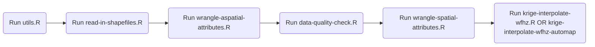

# Spatial interpolation of acute malnutrition: a quest using probability proportional to the size of the population-based survey data

To effectively combat this public health issue, enhancing the ability to
tell *where* acute malnutrition is of great concern over other areas is
paramount. Possessing this information leverages the ability of
programmers to prioritize limited resources - that are now getting even
more shrunk amid the modern resource-constraint era.

This repository is an R implementation of a quest applying spatial
interpolation modelling techniques. The quest aims to explore the
usability of probability proportional to the size of the
population-based survey sampling data to predict the prevalence of acute
malnutrition from the observed sampling points to unobserved locations
across a given survey area of interest.

## Research (quest) question:

- Does spatial interpolation produce reliable (precise and accurate)
  estimates when applied to a small-scale PPS-based survey?

If yes:

- How comparable are the predicted estimates against the observed (from
  the original survey)

## Study area

The analysis covered the Karamoja region in Uganda. This region has an
area of 27,514 square kilometres and is subdivided into 9 districts
(admin level 2), namely Abim, Amudat, Kaabong, Karenga, Kotido, Moroto,
Nabilatuk, Nakapiripirit and Napak. The immediate lower administrative
units after districts are counties (admin level 4). There are 64
counties in Karamoja.

The quest used derived from a Food Security and Livelihood Assessment
(FSLA) conducted in February 2021. The FSLA was designed to represent
each district independently. It employed the SMART methodology..

{width = 200}

## Repository Structure

- `raw-data/`: a data frame of the input data. This is encrypted.
- `R/`: some handy user-defined functions.
- `scripts/`: a set of `R` scripts. These are split into different
  files, based on the specific task that they execute:
  - `data-quality-check.R`: plausibility check of anthropometric
    measurements.
  - `krige-interpolate-wfhz-automap.R`: spatial interpolation through
    automatic model construction.
  - `krige-interpolate-wfhz.R`: spatial interplolation through “manual”
    model construction.
  - `read-in-shapefiles.R`: reads the `.shp` shapefiles of the study
    area and sets the area coordinate reference system.
  - `wrangle-aspatial-attributes.R`: wrangles the anthropometric data to
    be fed into the spatial models.
  - `wrangle-spatial-attributes.R`: wrangles spatial attributes of the
    raw data to be fed into the spatial models.

The following workflow is recommended:

The above flowchart can be implemented simply by running the `scrip.R`
file found in the root directory.

## Reproducibility information

The repository was created in `R` version 4.4.2, and the following
dependencies were used:  
- `{readxl}` version 1.4.3  
- `{dplyr}` version 1.1.4  
- `{lubridate}` version 1.9.3  
- `{mwana}` version 0.2.1  
- `{sf}` version 1.0.19  
- `{spdep}` version 1.3.10  
- `{gstat}` version 2.1.2  
- `{stars}` version 0.6.8  
- `{automap}` version 1.1.16  
- `{ggplot2}` version 3.5.1  
- `{mapview}` version 2.11.2

## License

This repository is licensed under a GNU General Public License 3
(GPL-3).

## Feedback

If you wish to give feedback, file an issue or seek support, kindly do
so [here](https://github.com/spatial/ugd-karamoja-amn-interp/issues).

## Author

Tomás Zaba
